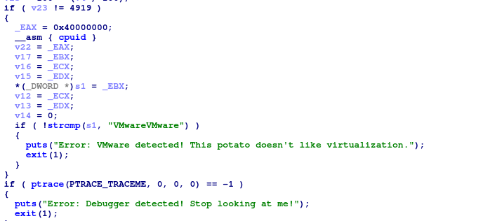
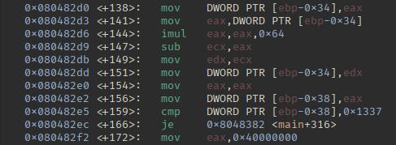

# Write-up Challenge: The Wise Potato's Riddle

Hello friends, I want to share my experience of solving this challenge and explain how it can be solved easily.  

First of all, install the 32-bit packages required for running:  

```bash
sudo apt-get install libc6:i386
```

At the beginning, when we analyze the challenge with **IDA**, we notice two checks:  
1. Whether the solver is using a **VMware** environment.  
2. Whether the solver is using a **debugger** (like `gdb`).  

---

## Step 1: Disable the VM check
Disabling the VM check is not difficult and can easily be done with a debugger.  
We run the challenge in `gdb`, disassemble the `main` function and check what happens in the VM detection part.
md

We notice at `main+159` there is a comparison against the constant `0x1337`.  
So the program expects the register `eax` to contain `0x1337` before this comparison.  
md

To bypass it, we set a breakpoint and change the register value:

```bash
gdb ./challenge
run
set $eax = 0x1337
```

---

## Step 2: Disable the debugger check
For disabling the `ptrace` anti-debugging check, we go to the call located at `main+331`.  
We set a breakpoint there and after continuing, we force the value of `eax` to be zero:

```gdb
b *main+331
continue
set $eax = 0
```
md

---

## Step 3: Answering the riddle questions
After bypassing the checks, we reach the part where the program asks some questions.  
The answers can be found in the book provided with the challenge.  

Example answers:  

```
law
Red
lea
Virtualization
```

After entering the correct answers, the program prints:  

```
Seed : 0x91e
```

---

## Step 4: Analyzing the seed
Now we check this address again in IDA.  
We see that the seed is added to a base address:  

```
0x080A0000 + 0x91E = 0x080A091E
```

At this address, we find a function (`update_state`) that checks four registers against constant values:

```
eax = 0x23
ecx = 0x48
edx = 0x12
edi = 0x10
```
md

---

## Step 5: Setting the registers in gdb
We repeat the steps, answer the questions again, and then set a breakpoint at this function.  
At that breakpoint, we modify the registers to the correct values:

```gdb
gdb ./challenge
b *main+154
b *main+331
b *0x080a091e
run
# when stopped at the breakpoint:
set $eax = 0x23
set $ecx = 0x48
set $edx = 0x12
set $edi = 0x10
```

At this point, the flag should be printed.  
**Note:** In this challenge, because of a bug in 32-bit package dependencies, the program may crash at the end.  
The challenge author stated that if you send your progress up to this step, they will provide you with the flag.  

---

## Important notes
- The questions **cannot** be patched directly; the solution is to manipulate registers at runtime.  
- Some systems may give errors at the end due to missing 32-bit packages.  
- Always make a backup of the binary before testing.  

---

## Example Answers Recap
- `law`  
- `Red`  
- `lea`  
- `Virtualization`  

After answering, the program prints: `Seed : 0x91e`.  

---

## Conclusion
The general method:  
- Use IDA to statically analyze the binary and find important addresses.  
- Use gdb to set breakpoints and modify registers to bypass the program’s checks.  
- Extract the flag after satisfying all conditions.  

---

