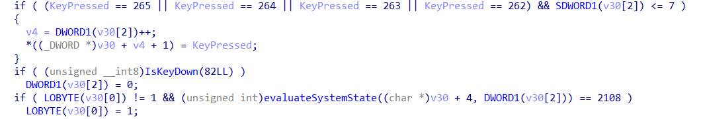

# Quantum Laboratory - CTF Write-up

So, you've found yourself trapped in a sketchy quantum lab. A big timer is counting up to two minutes before the whole place goes kaboom, and your only tool is a little red square.

## Step 1: First Recon - What Are We Even Looking At?

First thing you'll notice are the basics:

* You can move your red square with the arrow keys.
* There's a bunch of decorative blue shapes.
* A timer at the top is counting up to `02:00`.
* Status text at the bottom shows `Sequence: INVALID`, `Access: DENIED`, etc.
* A hint says `Hold [H] for HELP!`.

Hold **H**. The little dark square in the top-left corner starts blinking; it's Morse code. Time to decode it.

## Step 2: A Puzzle Inside a Puzzle - The Encrypted Hint

After decoding the Morse code, we get this:

`WKUHH UDSLG DQRPDOLHV`

This looks like a substitution cipher, likely a Caesar cipher. Look for a key in the game: among the blue shapes there are exactly **three circles**, each with a faint **'S'** inside. That suggests the number **3**.

Applying a Caesar shift of -3 reveals the real hint: `THREE RAPID ANOMALIES`. Now we know what to look for in the code.

## Step 3: Diving into the Code - Let's Open IDA

### 3.1 The First Trap: The Decoy Flag

A simple function named `integrityCheckBypass` returns `false`. Patching it to `true` yields a fake flag: `unlim{po0tat0}`. This is a decoy; do not rely on patching alone.

### 3.2 The Real First Step: The Konami Code

Inspect the code for the sequence validation. A function compares key presses to a hardcoded array corresponding to the Raylib key codes for:

`UP, UP, DOWN, DOWN, LEFT, RIGHT, LEFT, RIGHT`

The function also checks that the sum of these keys equals **2108**, an integrity check to prevent simple patching. The correct method is to input the sequence.

### 3.3 The "Anomalies" and the Time Lock

"THREE RAPID ANOMALIES" refers to a mouse sequence. Locate code that handles `IsMouseButtonPressed`.

The required mouse sequence is:

`Right-Click -> Left-Click -> Right-Click`

This block is only active during a time window checked by `if (currentTime > 15.0 && currentTime < 25.0)`.

The hint particle in the corner turns purple during this 10-second window as a visual cue.

## Step 4: The Grand Escape - Putting It All Together

Follow these exact steps to escape:

1. Start the game and wait.
2. Watch the hint particle in the top-left. When it turns purple (at the 15-second mark), the time window is open.
3. Enter the arrow key sequence: `UP, UP, DOWN, DOWN, LEFT, RIGHT, LEFT, RIGHT`. The status will change to `Sequence: VALID`.
4. While the particle is still purple, perform the mouse click sequence: `Right-Click, Left-Click, Right-Click`. The status will change to `Access: GRANTED`.
5. If done correctly and in time, the final flag will appear on the screen.

Do not touch the screen edges or the hint particle itself, or it's GAME OVER.

---

**Final Flag:** `unlim{Qu4n7um_3sc4p3_M4s73r}`

